# Machine Learning Threshold Optimization Based on Inspection Severity for Imbalanced Manufacturing Data

국문 제목: 불균형 제조 데이터에서 검사 엄격도 기반 머신러닝 임계치 최적화

Reproducible code and selected evidence for a manufacturing-quality inspection
policy that changes inspection strictness when recent lots show elevated risk.
The public package is deliberately limited to the three datasets used in the
paper: CNC Milling Tool Life, Resistance Spot Welding, and WM811K Wafer Map.

The project studies three practical questions:

1. Can a post-score decision policy improve defect-sensitive metrics without
   retraining the classifier?
2. Can tightened inspection focus effort on a small, high-risk portion of a
   process?
3. Does the improvement remain useful when missed defects are more costly than
   false alarms?

## Thesis results at a glance

The tables below are the proposed-policy results on the held-out test split.
They are reproduced from the submitted thesis and rounded to three decimals
for readability. `Threshold` is the selected decision threshold; F2 weights
Recall more heavily than Precision, and G-mean summarizes positive-class
recall together with negative-class specificity.

### RSW Gun

| Model | Threshold | Precision | Recall | F2 | G-mean |
| --- | ---: | ---: | ---: | ---: | ---: |
| XGBoost | 0.079 | 0.325 | 0.733 | 0.586 | 0.835 |
| LightGBM | 0.002 | 0.490 | 0.836 | 0.732 | 0.901 |
| CatBoost | 0.003 | 0.377 | 0.959 | 0.733 | 0.954 |

[Open the structured RSW Gun test results CSV](results/paper_tables/rsw_gun_test_results.csv)

### WM811K Wafer Map

| Model | Threshold | Precision | Recall | F2 | G-mean |
| --- | ---: | ---: | ---: | ---: | ---: |
| XGBoost | 0.449 | 0.279 | 0.617 | 0.496 | 0.738 |
| LightGBM | 0.485 | 0.212 | 0.696 | 0.478 | 0.750 |
| CatBoost | 0.440 | 0.298 | 0.587 | 0.492 | 0.726 |

[Open the structured WM811K test results CSV](results/paper_tables/wm811k_test_results.csv)

### CNC Milling Tool Life

| Model | Threshold | Precision | Recall | F2 | G-mean |
| --- | ---: | ---: | ---: | ---: | ---: |
| XGBoost | 0.001 | 0.960 | 0.889 | 0.902 | 0.938 |
| LightGBM | 0.001 | 1.000 | 0.574 | 0.628 | 0.758 |
| CatBoost | 0.003 | 0.977 | 0.778 | 0.811 | 0.880 |

[Open the structured CNC Milling Tool Life test results CSV](results/paper_tables/cnc_milling_tool_life_test_results.csv)

### Representative result tables from the thesis

These previews are the original result-table images extracted from the thesis
PDF. The complete Table 1–10 set is available below without requiring readers
to leave this landing page.

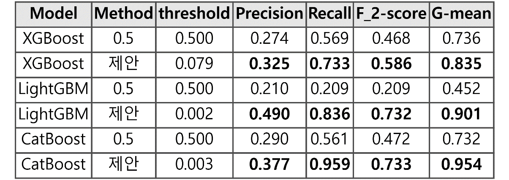

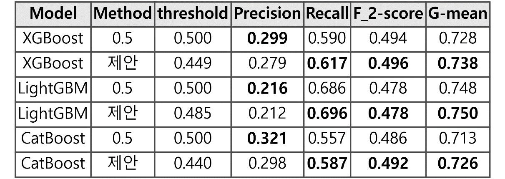

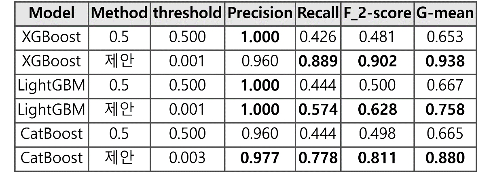

<details>
<summary>Open all thesis result tables (Table 1–10)</summary>

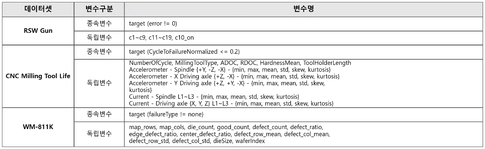


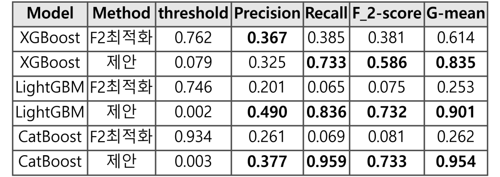

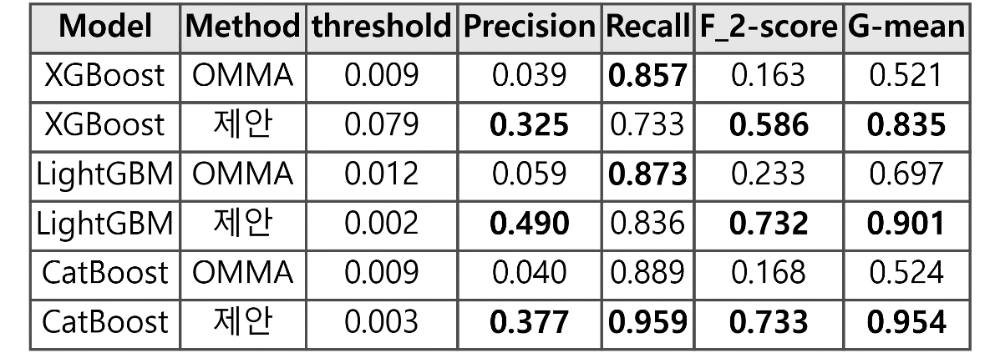


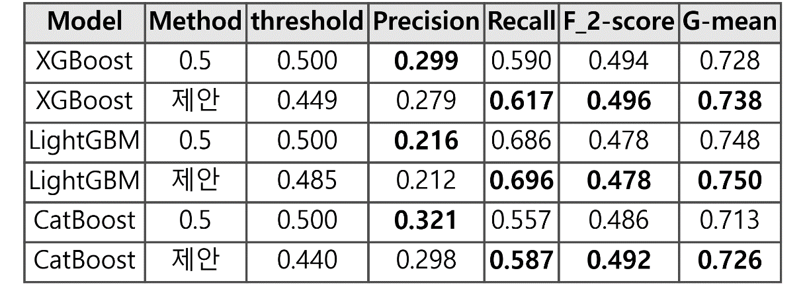

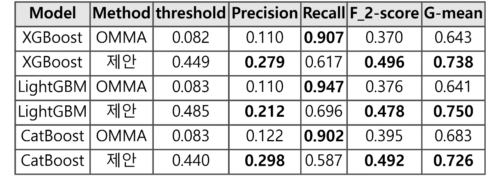


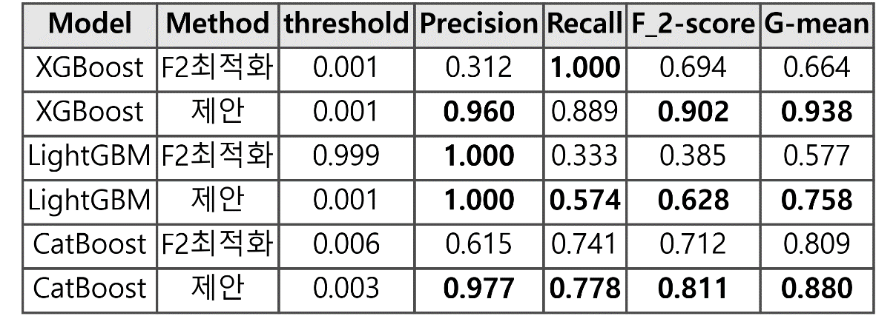

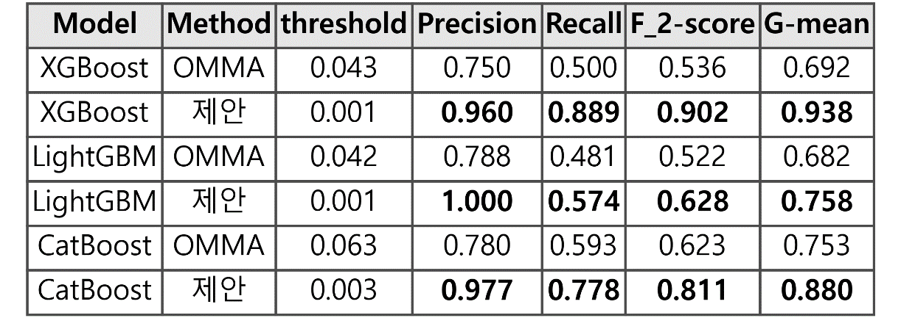

</details>

## Figures from the thesis

This gallery contains only figures that appear in the thesis. The images were
extracted from the submitted PDF so the public repository does not introduce a
new visual result that was not part of the paper.

### Figure 1 — Proposed research-model procedure

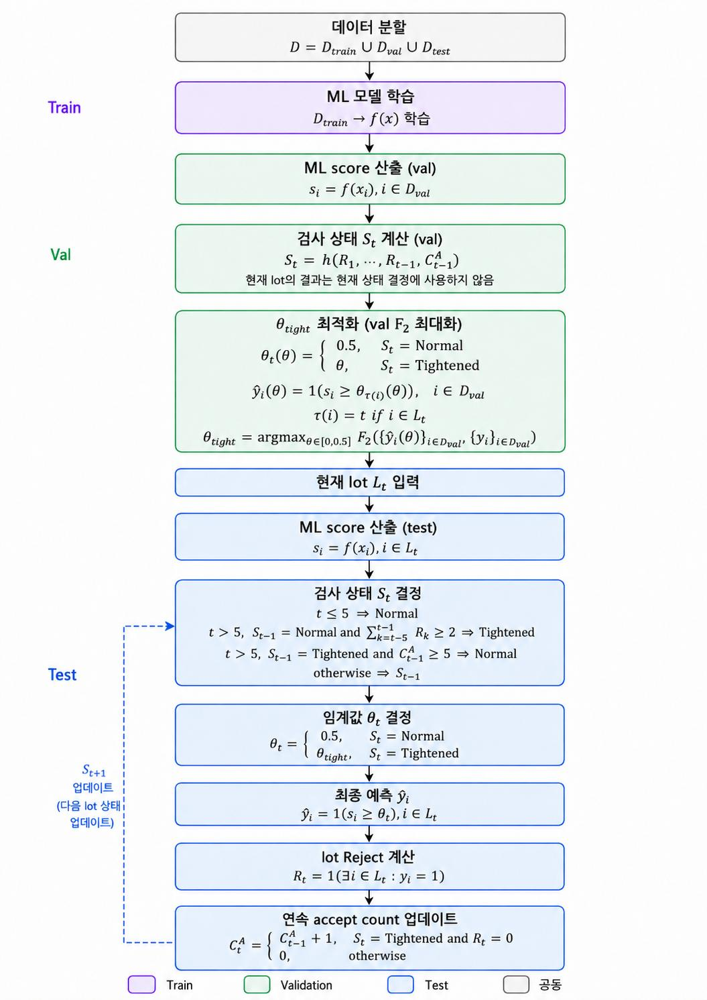

The method separates the data into train, validation, and test portions. The
classifier is trained once, while the validation split selects the tightened
threshold by maximizing F2. During testing, the current lot's inspection state
is determined before its outcome is observed. A recent history of at least two
rejected lots among five switches the next lot to Tightened inspection; five
accepted lots while Tightened return the next lot to Normal inspection. This
ordering is the paper's leakage guard.

### Figure 2 — Confusion Matrix

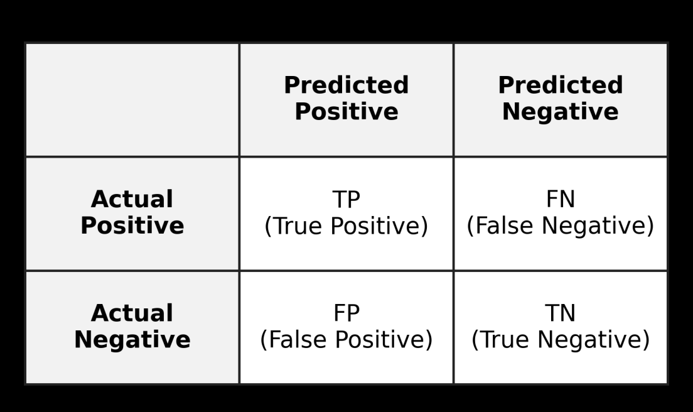

The paper evaluates each policy through TP, FP, FN, and TN. Precision measures
the reliability of positive predictions, while Recall measures how many actual
positive rows are found. F2 gives more weight to Recall than F1, which matches
the paper's emphasis on avoiding missed defects; G-mean balances positive-class
recall with negative-class specificity.

## Full result archive and interpretation

The same tables, CSV schemas, and interpretation notes are also documented in
[`results/paper_tables/README.md`](results/paper_tables/README.md). The broader
summary tables are in [`results/tables`](results/tables), with the method and
dataset explanations in
[`docs/method.md`](docs/method.md),
[`docs/results_interpretation.md`](docs/results_interpretation.md), and
[`docs/data_sources.md`](docs/data_sources.md).

## Repository layout

```text
src/thesis_policy/       Core metrics and online threshold policy
experiments/             Dataset builders and full experiment runners
scripts/                 Verification utilities
tests/                   Fast unit tests for the policy core
results/tables/          Small, tracked summary tables
results/paper_tables/    Thesis Tables 1–10 and structured result data
assets/figures/          Only the two figures appearing in the thesis
notebooks/               Final experiment notebooks
data/                    Instructions only; raw data is not committed
outputs/                 Local caches/models/results; ignored by Git
```

## Reproduction setup

The intended local layout keeps this repository next to the raw datasets:

```text
D:/졸업논문 데이터/
├── 논문 공개 코드/
├── cnc_milling_tool_life_2025/
├── rsw_gun/
└── wm811k/
```

Create an environment and install the package:

```powershell
cd 'D:/졸업논문 데이터/논문 공개 코드'
py -3.12 -m venv .venv
.\.venv\Scripts\Activate.ps1
python -m pip install --upgrade pip
python -m pip install -r requirements.txt
```

The lightweight install is enough for the policy tests and thesis figure
verification.
Install the optional model packages before running the full experiments:

```powershell
python -m pip install -r requirements-experiments.txt
```

The default data root is the repository's parent folder. On another machine,
set it explicitly:

```powershell
$env:THESIS_DATA_ROOT = 'D:/path/to/raw/datasets'
```

Generated caches, trained models, and large result files are written under
`outputs/`; they are not copied into the repository or committed to Git.

## Verify the public package

```powershell
python -m pytest
python scripts/verify_thesis_assets.py
```

To run a full dataset experiment after the raw data is available:

```powershell
python -m experiments.run_cnc_milling_tool_life
python -m experiments.run_rsw_gun_532s_rowlevel
python -m experiments.run_wm811k
```

These runs can be expensive, especially for the RSW dataset. The repository
does not silently download or copy raw data.

## Data and citation

Dataset provenance, exclusions, and the method description are documented in
[`docs/data_sources.md`](docs/data_sources.md) and
[`docs/method.md`](docs/method.md). Only the three paper datasets are supported;
raw files, model caches, and generated outputs are intentionally excluded from
Git.

This repository is a research artifact, not a production inspection system.
Use the reported results with the stated dataset and split assumptions.
