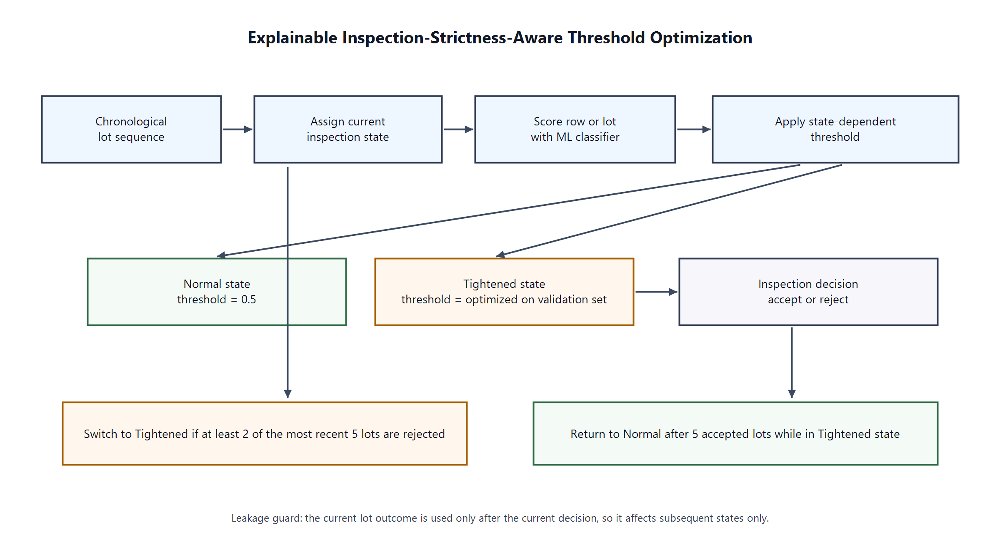
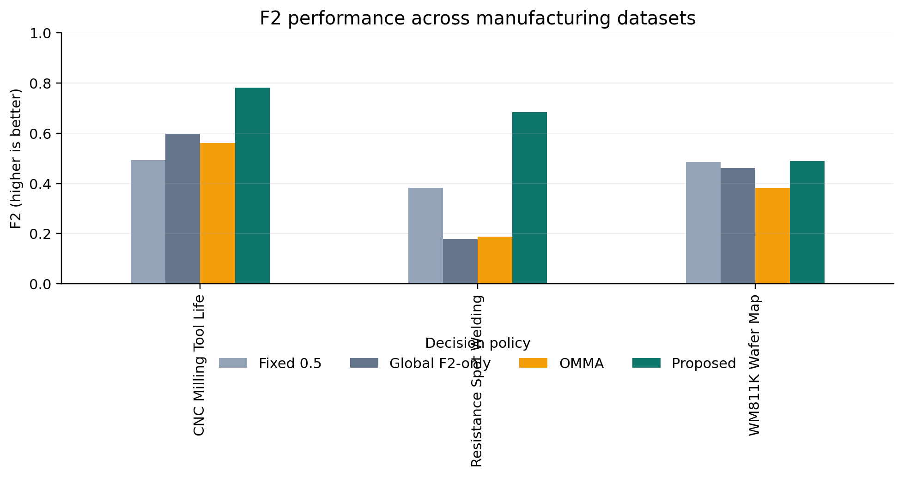
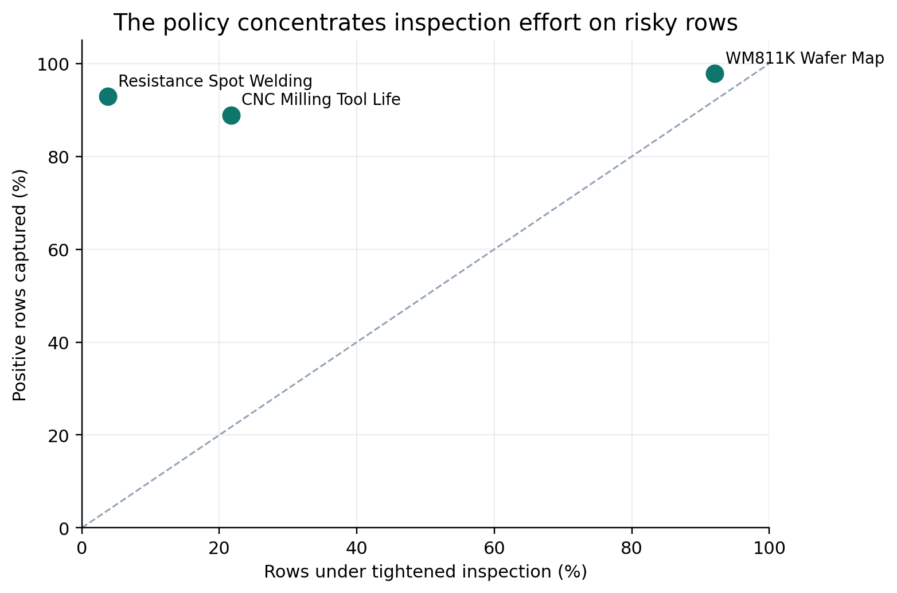
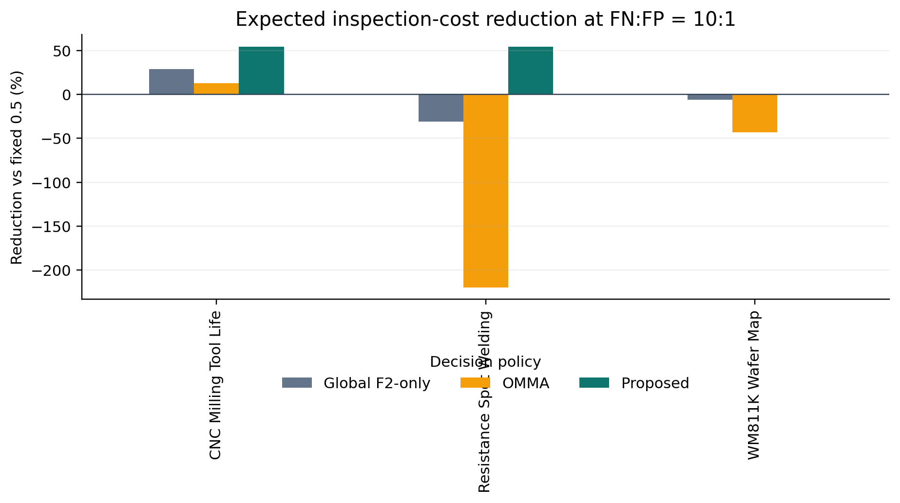

# Risk-Based Threshold Optimization for Imbalanced Manufacturing Inspection

Reproducible code and selected evidence for a manufacturing-quality inspection
policy that changes inspection strictness when recent lots show elevated risk.
The public package is deliberately limited to the three datasets used in the
paper: CNC Milling Tool Life, Resistance Spot Welding, and WM811K Wafer Map.

The project studies three practical questions:

1. Can a post-score decision policy improve defect-sensitive metrics without
   retraining the classifier?
2. Can tightened inspection focus effort on a small, high-risk portion of a
   process?
3. Does the improvement remain useful when missed defects are more costly than
   false alarms?

## Headline results

The tracked summary tables and figures are derived from the final experiment
artifacts. They are included so the repository is useful immediately after a
clone; raw datasets and trained model caches remain outside Git.









The main evidence tables are available in
[`results/tables`](results/tables), with methodological notes in
[`docs/method.md`](docs/method.md) and
[`docs/results_interpretation.md`](docs/results_interpretation.md).

## Repository layout

```text
src/thesis_policy/       Core metrics and online threshold policy
experiments/             Dataset builders and full experiment runners
scripts/                 Figure generation and utility scripts
tests/                   Fast unit tests for the policy core
results/tables/          Small, tracked summary tables
assets/figures/          Figures for the README and paper narrative
notebooks/               Final experiment notebooks
data/                    Instructions only; raw data is not committed
outputs/                 Local caches/models/results; ignored by Git
```

## Reproduction setup

The intended local layout keeps this repository next to the raw datasets:

```text
D:/졸업논문 데이터/
├── 논문 공개 코드/
├── cnc_milling_tool_life_2025/
├── rsw_gun/
└── wm811k/
```

Create an environment and install the package:

```powershell
cd 'D:/졸업논문 데이터/논문 공개 코드'
py -3.12 -m venv .venv
.\.venv\Scripts\Activate.ps1
python -m pip install --upgrade pip
python -m pip install -r requirements.txt
```

The lightweight install is enough for the policy tests and figure gallery.
Install the optional model packages before running the full experiments:

```powershell
python -m pip install -r requirements-experiments.txt
```

The default data root is the repository's parent folder. On another machine,
set it explicitly:

```powershell
$env:THESIS_DATA_ROOT = 'D:/path/to/raw/datasets'
```

Generated caches, trained models, and large result files are written under
`outputs/`; they are not copied into the repository or committed to Git.

## Verify the public package

```powershell
python -m pytest
python scripts/build_figures.py
```

To run a full dataset experiment after the raw data is available:

```powershell
python -m experiments.run_cnc_milling_tool_life
python -m experiments.run_rsw_gun_532s_rowlevel
python -m experiments.run_wm811k
```

These runs can be expensive, especially for the RSW dataset. The repository
does not silently download or copy raw data.

## Data and citation

Dataset provenance, exclusions, and the method description are documented in
[`docs/dataset_source_citation_notes.md`](docs/dataset_source_citation_notes.md)
and [`docs/method_algorithm_and_reproducibility.md`](docs/method_algorithm_and_reproducibility.md).

This repository is a research artifact, not a production inspection system.
Use the reported results with the stated dataset and split assumptions.
